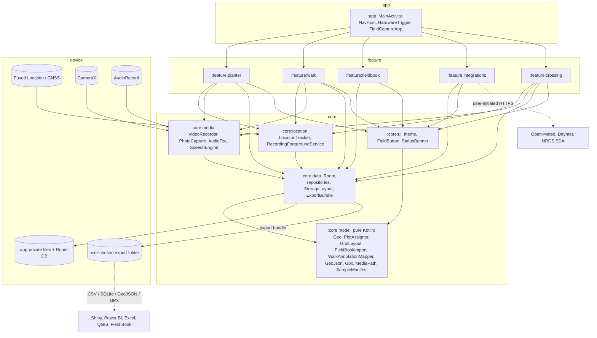

# field-capture-android — plan

## Problem statement

Public-sector soybean breeders plant thousands of envelopes a season with cone or belt planters and
walk the resulting nurseries taking notes. The planted position of each envelope is usually inferred
afterwards from the field map, not measured; notes are spoken into a recorder or scrawled on paper and
transcribed later; photos end up in a camera roll with no plot identity. The result is a set of files
that need hours of reconciliation before they can be joined to the field book in R or Power BI.

This project is an Android app that records, at the moment of the action, a GPS fix, a voice note and
its on-device transcript for every planted envelope, every walk-mode observation and every photo, and
writes them into a folder tree and a set of flat tables that mirror the field book's hierarchy, so the
export needs no reconciliation. It must work with no connectivity, on gloved hands in sunlight and
tractor noise, and it must keep nursery coordinates on the device until the breeder exports them.

## Users and workflow today vs. target

Users are graduate students, technicians and faculty in university and public breeding programs;
one to five people per program; Android phones or rugged tablets of mixed age; Field Book already in
use for trait scoring by some of them.

Today, planting: the field map (a CSV or XLSX from the design software) is printed; envelopes are
sorted in planting order; one person feeds the planter while another drives; position is inferred from
range/row counts, and a mis-fed envelope is discovered at harvest or never. Walking: notes are spoken
into a phone recorder or Field Book text traits; the plot identity comes from reading stakes; photos
are taken with the camera app and renamed later, if ever. After the season: CSVs are joined by hand,
weather is pulled from a station website, soil from Web Soil Survey, and yield from the combine's
export, each with its own plot naming.

Target, planting: the field file is imported, the planting order shown one plot at a time in large
type; each envelope is a trigger (thumb, volume key, Bluetooth button or the word "plant") that stores
the fix, the audio and the transcript and advances; pauses, skips and redos are events, not
confusion; the export contains each plot's measured coordinate. Walking: one button starts video and a
1 Hz track; the breeder talks; each utterance becomes an annotation positioned on the track and
assigned to a plot; a review screen shows the ambiguous ones with the video moment and the map so
they can be fixed in a minute. Photos are taken from inside the app and land in
`trial/field/plot/note_type/` with EXIF and a sidecar. After the season: one export folder with a
star schema, weather and soil already attached by field, harvest already joined by `plot_id`, and a
plate manifest for the progeny that go to genotyping.

## Scope and non-goals

In scope: planter mode, walk mode, photo capture, field import (Field Book–compatible CSV/XLSX and
generated grids), export bundle (CSV, GeoJSON, GPX, SQLite, Field Book–style CSVs, sample manifest),
weather and soil attachment, harvest CSV import, GIS layer display, crossing log with Intercross
interoperability, offline maps with an optional user-supplied basemap, Android 8.0+ (API 26).

Non-goals: trait-by-trait scoring with typed traits (Field Book does this); iOS; cloud sync or a
server component; BrAPI write-back in M0–M4 (ADR 0009); label printing; barcode-first workflows (a
scanner is a later input method, not the primary one); machine-vision analysis of the video; RTK
receiver support in M0–M2 (a later provider behind the same interface); multi-user merge.

## Reference projects and what is reused

Detailed notes with licences, layouts and what was and was not borrowed are in
`docs/reference-repos.md`. In brief: PhenoApps Field Book supplies the field import contract, the
`geo_coordinates` convention, the folder vocabulary and the Table/Database export distinction, and is
the interoperability target (ADR 0002); Intercross supplies the parents, wishlist and cross export
columns; nowinandroid supplies the module split, convention plugins and version catalog; ODK Collect
supplies minSdk 26 and the separation of location, audio and permissions into modules; QField
supplies the offline-first stance; MapLibre Native is the map (ADR 0005); Vosk is the speech engine
(ADR 0004); BrAPI shapes the schema (ADR 0009); GPS-Video-Logger's "video + GPX with the same stem" is
the pairing convention for walk sessions. No code was copied from any of them.

## Architecture

Single-activity Compose app; MVVM with unidirectional data flow (state down, actions up); Hilt for
injection; Room for records; WorkManager for export and fetch jobs; typed foreground services for
capture. Domain rules are pure Kotlin in `:core:model` and are the only place where plot assignment,
parsing and serialization are defined; `:core:data` persists and exports; `:core:location` and
`:core:media` wrap hardware; feature modules hold UI and orchestration and depend only on core
modules, never on each other; `:app` wires navigation and hardware key events.



Data flow during capture: hardware or voice trigger → feature ViewModel action → `LocationTracker.latest()`
and `SpeechEngine` result → `SessionRepository` write (Room + NDJSON track) → `MediaPath` names any
file → state emitted to the screen. During walk mode the track is appended at ≥ 1 Hz independently of
the UI by the foreground service; annotation assignment runs once at stop and again on demand from the
review screen using `WalkAnnotationMapper`.

## Data model and file contracts

Room entities (`core/data/.../Entities.kt`): dimensions `trials`, `fields`, `plots`, `sessions`; facts
`planter_events`, `annotations`, `observations`, `media`, `track_points`, `weather_daily`, `soil`,
`harvest`, `crosses`, `samples`. `plots.plotId` is Field Book's unique identifier and the join key for
everything; `attributesJson` preserves every import column. Domain types in `:core:model` (`Plot`,
`GpsFix`, `Annotation`, `PlotAssignment`) are mapped to entities in repositories so the pure module has
no Room dependency.

File contracts are specified column-by-column in `docs/data-formats.md`: field import (Field Book
columns, `geo_coordinates` lat;lon with lon;lat detection), grid layout inputs, the export bundle
(`manifest.json`, `plots.csv`, `plots.geojson`, `planter_events.csv`, `annotations.csv`,
`observations.csv`, `media.csv`, `points.geojson`, `tracks/<session>.gpx`, `fieldcapture.sqlite`,
optional Field Book–style CSVs, `sample_manifest.csv`, integration tables, media tree), the photo path
`media/<trial>/<field>/<plot_id>/<note_type>/<yyyyMMddTHHmmssZ>_<seq>.jpg`, the sidecar JSON schema
`fieldcapture.media.sidecar/1`, the NDJSON track sidecar, and the sample manifest columns. Writers for
GeoJSON (lon,lat per RFC 7946), GPX 1.1 and CSV (RFC 4180) are implemented and tested in
`core/model/.../Exports.kt`; the SQLite export is a checkpointed copy of the Room file.

## Field workflows

### Planter mode

1. Select field; the planting order is shown as "current / next / total" in display-size type; choose
   trigger sources (screen button, volume keys, Bluetooth button, voice) and STT engine.
2. Start: the foreground service starts with `location|microphone`; `LocationTracker` runs in PLANTER
   mode (high accuracy, 2 s interval); the audio tee starts; Vosk grammar is set to the ID list and
   command words.
3. Each trigger: read `latest(maxAgeMs = 3000, maxAccuracyM = 10)`; if a fix qualifies, store a PLANT
   event with lat/lon/accuracy/fix age; the current voice segment is closed and written as the note for
   this plot; the transcript is attached when the engine's final result arrives (it may arrive after
   the advance; the event is updated by id); advance to the next plot; short vibration and a spoken
   "next: R3 P7" cue from `TextToSpeech` if enabled.
4. Voice commands: "plant" triggers; "skip" stores SKIP and advances; "redo" stores REDO, marks the
   previous PLANT as superseded and moves back one; "pause"/"resume" store PAUSE/RESUME and stop or
   restart the advance without stopping the track; "note …" appends a free-text note to the current plot.
5. Manual correction: the event list (large rows, newest first) lets the user move an event to another
   plot or delete it; a CORRECT event records old and new `plot_id`; the plot's centroid is recomputed
   from its latest non-superseded PLANT event.
6. Finish: session closed; plots without a PLANT event are listed; export prompt.

Failure paths. GPS loss: `GpsState.Lost` shows a red banner and the event is stored without a fix and
with `fix_age_ms = null`; at finish, missing positions are interpolated from neighbouring events in
planting order along the row and marked `coord_source = MANUAL`-pending until the user accepts them on
the map. STT failure or engine unavailable: audio is still recorded (the tee owns the microphone);
the transcript is empty and the plot shows a microphone-off badge; the review list allows typing the
note. App killed mid-session: the foreground service keeps recording while the process lives; if the
process dies, on next launch `SessionRepository.recoverInterrupted()` closes the open session, the
NDJSON track and the per-event audio files are reconciled with the database (every write is committed
per event, so at most the in-flight utterance is lost), and the user resumes at the next unplanted
plot. Low storage: a banner at 500 MB free, refusal to start a walk at 200 MB.

### Walk mode

1. Select field (plots need coordinates from planter mode, import or grid); choose video quality
   (FHD default with HD/SD fallback) and whether video is on (audio-only walks are allowed).
2. Start: foreground service with `location|microphone|camera`; `VideoRecorder.start` into
   `sessions/<id>/video.mp4`; the first `VideoRecordEvent.Start` fixes `started_at`; track at 1 Hz to
   `track.ndjson` and Room in batches of 10; audio tee to the engine with the plot-ID grammar and open
   vocabulary.
3. During: each final STT result becomes an annotation with `timestamp` = utterance end and
   `video_offset_ms` = timestamp − started_at; the current plot (from the last fix) is shown large;
   a PHOTO action captures a still with the current plot and note type.
4. Stop: `WalkAnnotationMapper.map` assigns every annotation (polygon containment, else nearest
   centroid ≤ 6 m); items with `needsReview` (no fix, ambiguous, extrapolated, or across a > 5 s gap)
   are listed first in the review screen with the map, the audio clip and the video moment; the user
   confirms or reassigns; reassignments store MANUAL and `manually_corrected`.
5. Observations: transcripts matching "<trait> <value>" patterns from a small dictionary
   ("lodging three", "height ninety") are proposed as `observations` rows; the user accepts per item.

Failure paths. GPS loss: the track has a gap; annotations inside it are interpolated with inflated
accuracy and flagged; the banner shows "GPS lost 00:42". STT failure: audio segments are still cut at
silence boundaries and stored as annotations with empty transcripts; the review screen plays them.
App killed: video is finalized by CameraX's Recorder on process death where the OS allows it
[inference]; the track NDJSON is complete to the last second; on restart the session is closed and the
mapper runs on what exists; if the MP4 is unreadable the session keeps audio and track and reports the
video as lost in the sidecar. Camera unavailable (permission denied, no rear camera): audio-only walk.

### Photo capture

Available from the walk screen, the plot list and the map. The request carries `PlotKey`, note type,
the latest fix and bearing. `PhotoCapture` writes the JPEG to `MediaPath.photo(...)`, sets EXIF GPS,
`DateTimeOriginal`, `ImageDescription` = plot id and a JSON `UserComment`, writes the sidecar, hashes
the file and inserts a `media` row. When the plot is auto-assigned from position, the assignment and
runner-up distance are in the sidecar so a wrong assignment is detectable later. Failure paths: no fix
→ photo stored with position null and plot chosen manually; write failure → the capture is retried
into `filesDir` and the user is told which root was used.

### Crossing notes

1. Female and male are chosen from the plot list, by voice ("cross forty-two by seventeen") or by
   barcode (later); a fix is taken at save; a voice note is optional.
2. The cross gets `crossID` (user pattern, default `<female>x<male>_<yyyyMMdd>_<n>`), timestamp,
   person, lat/lon/accuracy, pollinations attempted.
3. Follow-up entries (pods set, seed count) are added from the cross list, geotagged again.
4. Export writes Intercross columns first and the app's extra columns after; imports accept Intercross
   parents and wishlist files to pre-populate parents and a planned-cross checklist.

Failure paths are those of planter mode: no fix → saved without position and flagged; STT failure →
typed entry; app killed → each cross is one committed row.

## Integrations

Weather. Open-Meteo is the primary source: global coverage, no API key for non-commercial use, an
archive endpoint (`archive-api.open-meteo.com/v1/archive`, ERA5/ERA5-Land, 5-day delay, daily
tmax/tmin/precipitation/ET0/shortwave radiation) and a forecast endpoint with soil temperature and
moisture layers [web: https://open-meteo.com/en/docs/historical-weather-api, https://open-meteo.com/en/docs];
free-tier terms are fewer than 10,000 calls/day, 5,000/hour, 600/minute, non-commercial use, and
CC-BY 4.0 attribution [web: https://open-meteo.com/en/terms]. Daymet is the secondary source for North
American season summaries: 1 km, 1980 to the latest complete calendar year, tmax/tmin/prcp/srad/vp/
swe/dayl, no key, citation required [web: https://daymet.ornl.gov/web_services]. NWS's api.weather.gov
is not used for history: it is US-only, forecast-centric, requires a User-Agent, and refers archive
users to NCEI [web: https://www.weather.gov/documentation/services-web-api]. Fetches are WorkManager
jobs with a connectivity constraint, started by the user per field and date range, and every response
is stored with its request URL and time. Whether a university breeding program's use is
"non-commercial" under Open-Meteo's terms is for the user to confirm (Risks).

Soil. USDA NRCS Soil Data Access: `POST https://SDMDataAccess.sc.egov.usda.gov/Tabular/post.rest` with
`QUERY` and `FORMAT=JSON+COLUMNNAME`, no key, 100,000-row cap [web:
https://sdmdataaccess.nrcs.usda.gov/WebServiceHelp.aspx]; the helper
`SDA_Get_Mukey_from_intersection_with_WktWgs84` returns map-unit keys for a WKT geometry [web:
https://sdmdataaccess.sc.egov.usda.gov/documents/AdvancedQueries.html]; `mapunit` and `component`
provide `musym`, `muname`, `compname`, `comppct_r`, `majcompflag`, `taxclname` [web:
https://ncss-tech.github.io/AQP/soilDB/SDA-tutorial.html]. One query per field polygon (or per plot
centroid when a field spans map units) yields `soil.csv`; optional map-unit polygons can be fetched
as a GIS layer.

Harvest. Mirus exports comma-delimited files with plot id, weight, moisture, test weight, yield and
plot size in Standard or Advanced column sets [web:
https://harvestmaster.com/data/support/manuals/Mirus-for-GrainGage-HTML/6-Field_Maps.html]; a fixed
header list is not publicly documented in the pages fetched, and the ARM guide only confirms
`.csv`/`.mtoa` output [web: https://gdmdata.com/media/documents/Connecting_ARM_with_HarvestMaster_Mirus.pdf?v=1606173431].
Import is therefore a column-mapping dialog with saved profiles; the join is on `plot_id` with a
report of unmatched rows.

GIS. GeoJSON and KML layers are imported unchanged and rendered as MapLibre sources; they are visual
context only.

BrAPI. Deferred per ADR 0009; the schema is BrAPI-shaped and a read-only study import is the first
candidate feature after M4.

## Downstream analytics schema

One export folder is one star schema: `plots` (grain = plot) joins by `plot_id` to `planter_events`,
`annotations`, `observations`, `media`, `harvest`, `samples`, and to `crosses` twice (female, male);
`fields` joins by `field_id` to `weather_daily` and `soil`; `sessions` is a dimension for the
event-type facts. The same tables exist in `fieldcapture.sqlite`. In R: `DBI::dbConnect(RSQLite::SQLite(),
"fieldcapture.sqlite")` then `dplyr` joins, or `readr::read_csv` over the folder; a Shiny app reads
the folder path and gets typed columns from `manifest.json`. In Power BI: the Folder connector on the
export directory (Combine Files) or the SQLite ODBC driver on the database; relationships are
`plots[plot_id]` one-to-many to each fact and `fields[field_id]` one-to-many to weather and soil.
Column names are lower snake case with unit suffixes (`weight_kg`, `precip_mm`) so no renaming step is
needed, and every timestamp is UTC ISO 8601 so time zones are handled once, in the BI layer.

## UI walkthrough

Global rules: minimum 72 dp touch targets for primary actions (`FieldButton`), 20 sp body text,
44 sp for the current plot id, a light background with near-black text and saturated status colours
for sunlight (`FieldTheme`), status as persistent banners rather than toasts, every primary action
reachable by volume key or voice, no gestures that require precision (no swipes to delete), landscape
and portrait both supported.

Home: field list with unexported-session count, buttons Plant, Walk, Photo, Cross, Import, Export.
Field detail: plot count, coordinate source summary, sort order, map, "Create grid" and "Import" entry
points. Import: file picker (SAF), column pickers for unique/primary/secondary ids, validation report
with row numbers, preview of the first ten plots. Planter: current plot id (44 sp), next plot, progress,
one full-width PLANT button, a row of PAUSE / SKIP / REDO, GPS accuracy and STT state banners, the last
transcript in large text, an event list behind a tab. Walk: camera preview (dimmable to save battery),
current plot, elapsed time, fix count, STOP and PHOTO buttons, last transcript, banners. Review: list
sorted by `needsReview`, each row with transcript, plot, distance, a play button, and "open video here";
tapping the plot opens a picker with the nearest five plots and the map. Photo: note-type chips, shutter,
plot override. Crossing: female/male chips with voice fill, pollinations stepper, SAVE, today's list.
Integrations: per-field cards for weather, soil, harvest, layers with last-fetched time and errors.
Export: bundle checklist, destination picker, progress, result list with file count and size.
Settings: person name, STT engine and model download, trigger sources, map style URL and offline
region download, units, Open-Meteo key (optional), storage usage.

## Technology decisions

ADRs in `docs/adr/`: 0001 stack (Kotlin, Compose, MVVM/UDF, Hilt, Room, WorkManager, CameraX, Fused
Location); 0002 build-vs-extend (new Field Book–compatible app, MIT); 0003 storage (Room + app-private
files, SAF export, no backup); 0004 speech-to-text (Vosk default, platform recogniser optional,
whisper.cpp batch); 0005 map (MapLibre Native; plots-only mode without tiles); 0006 minSdk 26 /
targetSdk 36; 0007 licence (MIT); 0008 export formats (CSV + GeoJSON + GPX + SQLite bundle); 0009 BrAPI
(schema-aligned, sync deferred). Speech and map module-boundary choices were modelled on nowinandroid's
core/feature split and Field Book's separation of a BrAPI provider module.

## Repository layout

```
field-capture-android/
├── PLAN.md                         this document
├── README.md                       what it does, build, status
├── CHANGELOG.md                    Keep a Changelog 1.1.0; 0.1.0 unreleased
├── CONTRIBUTING.md                 Conventional Commits, SemVer, ADR rule, local checks
├── LICENSE                         MIT
├── .editorconfig / .gitignore
├── .github/workflows/ci.yml        domain job (no SDK) then android job (lint, unit tests, detekt, APK)
├── settings.gradle.kts             module list; -PjvmOnly=true configures only :core:model
├── build.gradle.kts                plugin versions, detekt applied to all subprojects
├── gradle.properties
├── gradle/libs.versions.toml       version catalog (every coordinate resolved when written)
├── gradle/wrapper/                 gradle-wrapper.jar (only binary in the repo), properties
├── gradlew, gradlew.bat
├── config/detekt/detekt.yml
├── build-logic/                    included build: AndroidLibraryConventionPlugin, AndroidFeatureConventionPlugin
├── app/                            MainActivity (NavHost, HardwareTrigger), FieldCaptureApp, manifest, backup rules
├── core/model/                     pure Kotlin JVM (tested): Model, Geo, PlotAssigner+GridLayout, Csv,
│                                   FieldBookImport, WalkAnnotationMapper, Exports (GeoJson, Gpx, MediaPath), SampleManifest
├── core/data/                      Room Entities, FieldCaptureDatabase + DAOs + Hilt module, StorageLayout + repositories
├── core/location/                  LocationTracker, TrackingMode, GpsState, RecordingForegroundService
├── core/media/                     VideoRecorder, PhotoCapture, SpeechEngine (Vosk, platform), AudioTee
├── core/ui/                        FieldTheme, FieldButton, StatusBanner
├── feature/{planter,walk,fieldbook,integrations,crossing}/   UiState, Action, ViewModel skeletons
└── docs/
    ├── adr/0001-…0009-*.md         MADR
    ├── data-formats.md             column-level contracts and examples
    └── reference-repos.md          fetched repositories, licences, borrowed / not borrowed
```

## Testing and CI

Unit tests live where the logic lives: `:core:model` has 25 tests today covering grid generation,
polygon and nearest-centroid assignment with ambiguity flags, Field Book CSV parsing (auto-detection,
duplicates, illegal headers, both `geo_coordinates` orders), CSV tokenizing round-trip, track
interpolation across gaps, manual-correction precedence, GeoJSON coordinate order and escaping, GPX
structure, media path sanitization, ISO timestamps, and plate layout with reserved wells across plates.
M1 adds ID-pronunciation mapping tests and planter event state-machine tests (pure Kotlin); `:core:data`
gets Room migration tests and repository tests under Robolectric; features get ViewModel tests with
fake repositories and `kotlinx-coroutines-test`; M4 adds a Compose screenshot suite and an instrumented
smoke test on an emulator. Static analysis is detekt with `config/detekt/detekt.yml` on every module;
Android Lint runs in the full build.

CI (`.github/workflows/ci.yml`): job `domain` runs `./gradlew -PjvmOnly=true :core:model:test
:core:model:detekt` on JDK 17 without an Android SDK; job `android` runs `lint`, `testDebugUnitTest`,
`detekt` and `:app:assembleDebug` on `ubuntu-latest`, which provides an SDK; reports and the debug APK
are uploaded as artifacts.

## Distribution

Sideload first: GitHub Releases with a signed APK and the SHA-256 in the release notes, which is how
Field Book and Intercross also ship alongside Play [web: https://github.com/PhenoApps/Field-Book,
https://github.com/PhenoApps/Intercross]. Signing: a release keystore held outside the repository;
CI signs from `KEYSTORE_BASE64`, `KEYSTORE_PASSWORD`, `KEY_ALIAS`, `KEY_PASSWORD` secrets; `.gitignore`
excludes keystores and properties files. F-Droid at M4: the app has no proprietary dependencies or
analytics, which the inclusion policy requires [web: https://f-droid.org/docs/Inclusion_Policy/]; the
Vosk model is downloaded with explicit consent, not bundled; `play-services-location` is the one
Google dependency and will be swapped for `LocationManager` in the F-Droid flavour if the policy
requires it [inference]. Google Play: a one-time US$25 registration fee, identity verification, and
for personal accounts a closed-testing requirement before production [web:
https://support.google.com/googleplay/android-developer/answer/6112435]; target API 36 by 2026-08-31
[web: https://support.google.com/googleplay/android-developer/answer/11926878]. Play is worth doing once
M3 is stable because it is how most collaborators expect to install. Cost otherwise: none beyond the
developer's time and the Play fee.

## Milestones

M0 — scaffold (this deliverable). Acceptance: `./gradlew -PjvmOnly=true :core:model:test
:core:model:detekt` passes; all modules have build files, manifests and documented placeholders; PLAN,
ADRs, data formats and reference notes exist; CI workflow present.

M1 — planter-mode vertical slice. Acceptance: import a Field Book CSV and a generated grid; run planter
mode end-to-end on a device with screen, volume-key and voice triggers; PLANT/SKIP/REDO/PAUSE/RESUME/
CORRECT events persisted; Vosk grammar recognition of a 200-plot ID list ≥ 90 % on a recorded test set
in a quiet room (tractor-noise figure recorded, not gated); audio per event; export `plots.csv`,
`planter_events.csv`, `plots.geojson`, `points.geojson`; process-kill recovery test passes; battery
drain over a 2-hour planter session measured and recorded.

M2 — walk mode + export. Acceptance: 30-minute walk with video, 1 Hz track with ≥ 95 % of seconds
present in open sky, annotations mapped with `needsReview` flags, review screen corrections persisted,
photos with EXIF and sidecars in the `trial/field/plot/note_type` tree, GPX and SQLite in the bundle,
Field Book–style CSVs, sample manifest, MapLibre plots-only map and optional offline region; a Shiny
example and a Power BI example open the bundle without manual renaming.

M3 — integrations + crossing. Acceptance: Open-Meteo archive and Daymet fetch for a field and date
range with stored request/response; SDA soil query by field polygon; harvest CSV import with a saved
mapping profile and an unmatched-rows report; GeoJSON/KML layer display; crossing log with
Intercross-compatible export and parents/wishlist import.

M4 — hardened. Acceptance: instrumented smoke test in CI; Compose screenshot suite; Robolectric
repository and migration tests; accessibility scan (touch target and contrast) clean; F-Droid
metadata; signed release on GitHub; optional whisper.cpp re-transcription; About screen with
third-party notices; battery and storage budgets documented from measurements.

## Risks and open questions

- Vosk accuracy on plot IDs under tractor noise is unknown; mitigation is grammar constraint, a
  push-to-talk window around each trigger, and audio retained for later correction. Open question:
  the user's ID format, so that pronunciation aliases can be generated.
- Phone GPS accuracy (typically 3–5 m) versus 0.76 m row spacing: planter-mode positions locate
  envelopes to within a plot, not a row; walk-mode assignment relies on polygons or ≥ 3 m plot
  spacing. Open question: is an external RTK/NMEA receiver available, in which case M2 adds a provider
  as Field Book's GNSS trait does?
- Continuous video plus 1 Hz GPS plus STT for hours: battery and thermal behaviour are device-specific
  and unmeasured; mitigations are a dimmable preview, HD default, and audio-only walks.
- Open-Meteo's non-commercial terms and Daymet's citation requirement must be acceptable to the
  program; NWS is not a history source.
- Mirus header names are undocumented publicly; the mapping-profile approach assumes a stable per-site
  export configuration.
- Field Book's `geo_coordinates` order (docs say lat;lon, the sample is lon;lat): the importer
  detects and warns, but the export back to Field Book must pick one; open question to confirm with a
  Field Book import test.
- `SpeechRecognizer` offline behaviour varies by OEM; it is optional, not required.
- The `applicationId` `org.fieldcapture.app` must be changed to a domain the maintainer controls
  before any store listing.
- Two apps (this and Field Book) on one tablet: is a single "Field Book–only" hand-off enough, or is
  a shared storage location wanted?
- Sample manifest: which genotyping provider's plate template (well order, controls) should be the
  default, and should `sample_id` be generated or user-supplied?

## Assumptions

Soybean nurseries with row spacing near 0.76 m and plots 3–6 m long; one device per crew; English
speech; Android 8.0+ devices with GPS, microphone and a rear camera; no connectivity in the field but
Wi-Fi at the office; the breeder is willing to export data manually; Field Book remains the tool for
typed trait scoring; a JDK 17+ and Android Studio are available to the developer; the maintainer will
create the Play and signing credentials outside the repository.

## Verification status

Environment: Linux container, OpenJDK 21.0.10, Gradle 8.14.3 (system install), no Android SDK,
outbound HTTPS through a proxy. Commands were run from the repository root.

```
gradle -PjvmOnly=true :core:model:test --no-daemon --console=plain
  BUILD SUCCESSFUL in 20s; 25 tests PASSED (ExportsTest 6, FieldBookImportTest 7, PlotAssignerTest 7,
  WalkAnnotationMapperTest 5); JUnit XML: 25 tests, 0 failures, 0 errors, 0 skipped.
  (First attempt failed on a JDK-17 toolchain requirement with only JDK 21 installed; fixed by
  targeting JVM 17 bytecode without a toolchain. Second attempt failed on two test names containing
  ';'; renamed.)

gradle -PjvmOnly=true :core:model:detekt --no-daemon --console=plain
  BUILD SUCCESSFUL; 0 issues. (First run reported 6 findings — CyclomaticComplexMethod, ReturnCount ×2,
  LoopWithTooManyJumpStatements, MaxLineLength ×2 — all fixed in code, not suppressed.)

gradle -p build-logic assemble --no-daemon --console=plain
  BUILD SUCCESSFUL in 35s; both convention plugins compile against AGP 8.13.0 and KGP 2.2.21 APIs.

gradle wrapper --gradle-version 8.14.3 --distribution-type bin --no-daemon
  BUILD SUCCESSFUL; gradle/wrapper/gradle-wrapper.jar (43,764 bytes) generated.

./gradlew -PjvmOnly=true :core:model:test :core:model:detekt --rerun-tasks --no-daemon --console=plain
  Downloaded gradle-8.14.3-bin.zip through the wrapper; BUILD SUCCESSFUL in 28s; 25 PASSED lines.

find . -type f | wc -l      → 81   (after deleting .gradle/, build/, .kotlin/)
du -sh .                    → 888K
find . -type f -size +100k  → none; the only non-text file is gradle/wrapper/gradle-wrapper.jar
```

Not verified (no Android SDK in the container): configuration and compilation of `:app`, `:core:data`,
`:core:location`, `:core:media`, `:core:ui` and the five feature modules; Android Lint; Room schema
generation; Hilt/KSP processing; manifest merging. The command a user should run with an SDK installed
is `./gradlew lint testDebugUnitTest detekt :app:assembleDebug`. Until that has been run, the Android
modules are to be treated as unverified scaffolds.

Dependency coordinates: every group:artifact:version in `gradle/libs.versions.toml` and the two AAR
coordinates in `core/media/build.gradle.kts` returned HTTP 200 for its POM on Maven Central or Google
Maven at the time of writing (checked with `curl -I`).

Cited URLs: the 84 distinct URLs in `PLAN.md`, `README.md`, `CHANGELOG.md`, `CONTRIBUTING.md`,
`docs/data-formats.md`, `docs/reference-repos.md` and `docs/adr/*.md` were re-fetched with `curl -L`
at the end of scaffolding: 63 returned 200; 15 `github.com` repository pages returned 403 to curl
through the container's proxy and were re-confirmed through the browser-based fetch tool (three
spot-checked at the end: GPS-Video-Logger, osmdroid, vosk-android-demo); the four
`docs.fieldbook.phenoapps.org` pages failed DNS on the curl path and one was re-confirmed through the
fetch tool (`export.html`, title "Export layout"); two API endpoint strings
(`SDMDataAccess.sc.egov.usda.gov/Tabular/post.rest`, `daymet.ornl.gov/single-pixel/api/data?lat=`)
returned 400 to a parameterless request, which is the expected response for endpoints that require
parameters; `docs.intercross.phenoapps.org` and `github.com/alphacephei/vosk-android-demo` are listed
in `docs/reference-repos.md` as URLs that did not resolve and are not used as sources.
